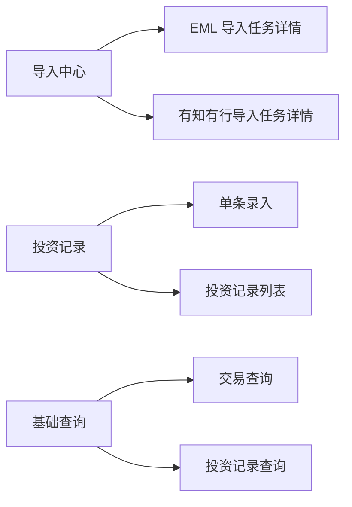

# M0 信息架构（收敛版）

## 1. M0 导航

M0 仅保留以下页面：
- 导入中心
- 投资记录
- 基础查询
- 设置（最小项：数据目录与隐私开关）

## 2. 站点地图

## 3. 页面职责边界

| 页面 | 负责 | 不负责 |
|---|---|---|
| 导入中心 | 两类导入（EML/有知有行）、任务状态、错误反馈 | 预算分析、对账 |
| 投资记录 | 单条录入、基础编辑、列表查看 | 批量导入 |
| 基础查询 | 按筛选条件查询交易与投资记录并展示 | 复杂分析报表 |
| 设置 | 本地配置与隐私展示开关 | 业务数据维护 |

## 4. 关键跳转

1. EML 导入成功后跳转到基础查询并带 `source_type=cmb_eml`。
2. 有知有行导入成功后跳转到基础查询并带 `source_type=youzhiyouxing_export`。
3. 投资记录单条保存后返回投资记录列表并高亮新增行。

## 5. M0 交互约束

- 导入都必须先预览再确认。
- 导入失败必须展示可读错误信息。
- 基础查询只做“筛选 + 列表 + 简单汇总”，不做复杂图表。

