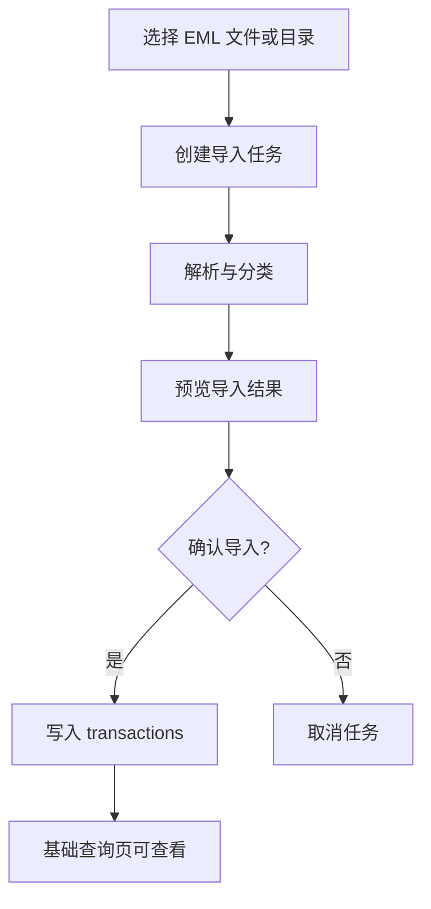
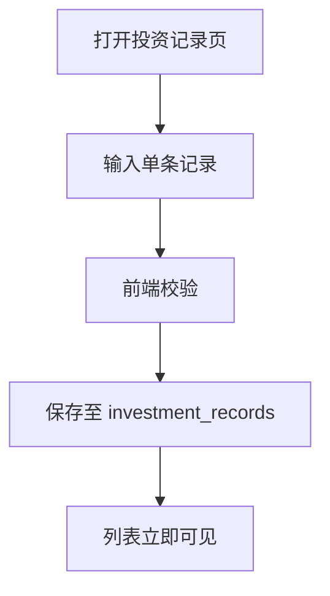
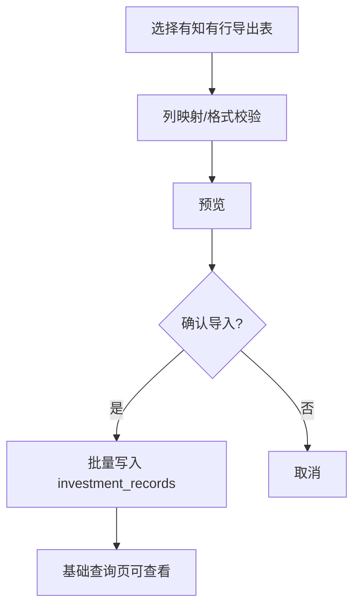

# M0 产品流程定义（收敛版）

## 1. M0 目标（仅以下四项）

生效日期：2026-02-12

M0 只做：
1. EML 的交互式导入。
2. 投资记录的交互式单条录入。
3. 从有知有行导出的投资记录表批量导入。
4. 支撑以上能力的数据结构调整，以及基础数据查询和展示。

## 2. 非目标（M0 不做）

- 预算模块。
- 对账模块。
- 手工消费记账 CRUD（除导入落库外）。
- AI 建议。
- 云同步/多端。

## 3. 用户流程 A：EML 交互式导入

步骤：
1. 用户在导入中心选择 `EML` 来源和文件。
2. 系统创建任务并解析。
3. UI 展示预览：总条数、失败条数、待确认条数。
4. 用户确认后写入交易表。
5. 用户可在基础查询页按月份/分类查看。

## 4. 用户流程 B：投资记录交互式单条录入

步骤：
1. 用户填写日期、账户、总资产、外部转入/转出、备注。
2. 系统校验必填字段与金额格式。
3. 保存成功后返回列表并高亮新记录。

## 5. 用户流程 C：有知有行导出表批量导入

步骤：
1. 用户在导入中心选择 `有知有行导出` 来源。
2. 系统校验表头并显示映射结果。
3. 用户确认后批量写入投资记录。
4. 导入结果可按任务回溯。

## 6. 页面输入/输出（M0）

| 页面 | 输入 | 输出 |
|---|---|---|
| 导入中心 | 来源类型（EML/有知有行）、文件 | 任务状态、预览结果、导入统计 |
| 投资记录 | 单条表单字段 | 新增记录、校验错误提示 |
| 基础查询页 | 月份、来源、账户等筛选 | 交易列表、投资记录列表、基础汇总 |

## 7. M0 验收标准

1. 可在 UI 中完成 EML 导入全流程（选择 -> 预览 -> 确认 -> 入库）。
2. 可在 UI 中完成投资记录单条录入并立即可查。
3. 可导入有知有行导出表并正确写入投资记录。
4. 所有导入数据可通过基础查询页检索和展示。
5. 导入任务有状态与错误信息，可追溯。

